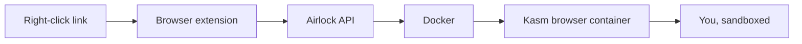

# Airlock 🔐

[](LICENSE)

[](https://www.typescriptlang.org/)
[](https://bun.sh)
[](https://expressjs.com/)
[](https://www.docker.com/)
[](https://vitest.dev/)
[](https://oxc-project.github.io/)
[](https://prettier.io/)
[](https://kasmweb.com/)

Local, disposable browser isolation. Right-click any link and open it in a short-lived, containerized browser session.



## Quick Start

```bash
bun install
cp .env.example .env
bun run dev:api    # terminal 1
bun run dev:worker # terminal 2
```

Or with Docker Compose:

```bash
docker compose up
```

Then load the [browser extension](docs/extensions.md) and right-click any link.

## Documentation

- [Architecture](docs/architecture.md) — How it works, monorepo layout, security
- [Configuration](docs/configuration.md) — Environment variables, prerequisites
- [API Reference](docs/api.md) — Endpoint documentation
- [Extensions](docs/extensions.md) — Loading the Chrome and Firefox extensions

## License

[PolyForm Shield 1.0.0](LICENSE) — free to use, modify, and distribute, but not to build a competing product or service.
