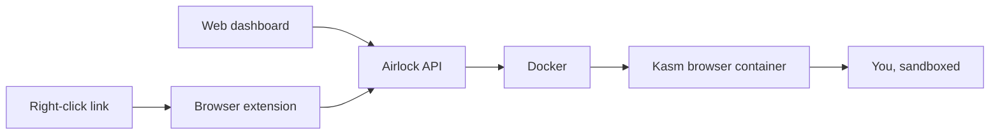

# Airlock 🔐

[](LICENSE)

[](https://www.typescriptlang.org/)
[](https://bun.sh)
[](https://expressjs.com/)
[](https://react.dev/)
[](https://vite.dev/)
[](https://www.docker.com/)
[](https://vitest.dev/)
[](https://oxc-project.github.io/)
[](https://prettier.io/)
[](https://kasmweb.com/)

Local, disposable browser isolation. Open any link in a short-lived,
containerized browser session — from a **web dashboard** or by **right-clicking
a link**. Like a cloud-browser service, but it runs entirely on your own
machine. No cloud, no account, no data leaving the host.



## Quick Start

```bash
bun install
cp .env.sample .env
bun run dev:api    # terminal 1 — API
bun run dev:worker # terminal 2 — cleanup worker
bun run dev:web    # terminal 3 — dashboard at http://localhost:5173
```

Or run the whole thing from the shared image with Docker Compose (dashboard +
API + worker on <http://localhost:8787>):

```bash
docker compose up
```

Open the dashboard to launch a browser, or load the
[browser extension](docs/extensions.md) and right-click any link.

## Two ways in

- **Dashboard** (`apps/web`) — launch a browser, watch active sessions count
  down, embed the live stream, terminate. See [docs/web.md](docs/web.md).
- **Extension** — right-click a link → "Open in Airlock". See
  [docs/extensions.md](docs/extensions.md).

## Deploying

Airlock is local-first but **provider-pluggable**: one shared image, adapters
for Docker Compose, a VM, Kubernetes, Fly, Render, and Railway. See
[docs/deployment.md](docs/deployment.md) and [deploy/](deploy/README.md). Set
`AIRLOCK_API_TOKEN` before exposing the API beyond localhost.

## Documentation

- [Architecture](docs/architecture.md) — How it works, monorepo layout, security
- [Configuration](docs/configuration.md) — Environment variables, prerequisites
- [Web Dashboard](docs/web.md) — The browser-based launcher and manager
- [API Reference](docs/api.md) — Endpoint documentation
- [Deployment](docs/deployment.md) — Provider adapters and the deployment contract
- [Extensions](docs/extensions.md) — Loading the Chrome and Firefox extensions

## Checks

```bash
make check   # format, lint, typecheck, test, build (the gate CI runs)
```

## License

[PolyForm Shield 1.0.0](LICENSE) — free to use, modify, and distribute, but not to build a competing product or service.
