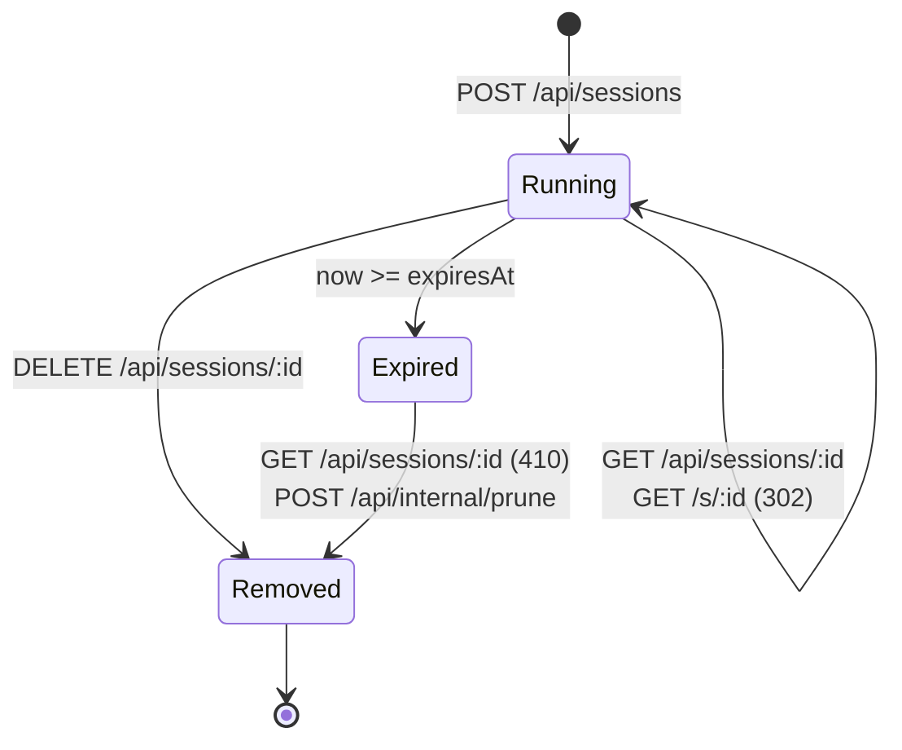

# API Reference

## Session States



Expiry is computed by the **session policy** module, not the route handlers. Reading an expired session triggers an immediate stop before the `410` is returned.

## Authentication

When `AIRLOCK_API_TOKEN` is set, the **management API** requires a bearer token:

```
Authorization: Bearer <AIRLOCK_API_TOKEN>
```

This guards `/api/meta` and every `/api/sessions` route. Three paths are
intentionally **auth-exempt**:

- `/healthz` and `/health` — probes must work without a token.
- `/s/:sessionId` — the session id is itself an unguessable capability, and the
  link is opened by plain browser navigation that cannot carry a header.

`POST /api/internal/prune` uses a separate shared secret
(`AIRLOCK_INTERNAL_TOKEN`), not the bearer token. When no `AIRLOCK_API_TOKEN`
is configured the guard is a no-op — convenient for local runs, unsafe to
expose. See [docs/configuration.md](configuration.md).

## Endpoints

| Method   | Path                       | Auth   | Description                                      |
| -------- | -------------------------- | ------ | ------------------------------------------------ |
| `GET`    | `/healthz`, `/health`      | none   | Health check                                     |
| `GET`    | `/api/meta`                | bearer | Browser catalog + TTL bounds for the dashboard   |
| `POST`   | `/api/sessions`            | bearer | Create a new browser session                     |
| `GET`    | `/api/sessions`            | bearer | List active sessions                             |
| `GET`    | `/api/sessions/:sessionId` | bearer | Get session details                              |
| `DELETE` | `/api/sessions/:sessionId` | bearer | Stop and remove a session                        |
| `POST`   | `/api/internal/prune`      | token  | Prune all expired sessions                       |
| `GET`    | `/s/:sessionId`            | none   | Public short URL (redirects to container stream) |

## `POST /api/sessions`

Create a new disposable browser session.

**Request body:**

```json
{
  "targetUrl": "https://example.com",
  "browser": "chromium",
  "ttlSeconds": 1800
}
```

| Field        | Type   | Required | Default    | Notes                                                                      |
| ------------ | ------ | -------- | ---------- | -------------------------------------------------------------------------- |
| `targetUrl`  | string | Yes      | —          | Must start with `http://` or `https://`                                    |
| `browser`    | string | No       | `chromium` | One of: `chromium`, `chrome`, `firefox`, `edge`, `brave`, `vivaldi`, `tor` |
| `ttlSeconds` | number | No       | `1800`     | Must be between 60 and 86400 (rejected with `400` if outside this range)   |

**Response (201):**

```json
{
  "sessionId": "...",
  "browser": "chromium",
  "targetUrl": "https://example.com",
  "browserUrl": "https://localhost:32792",
  "createdAt": "2026-04-20T05:30:00.000Z",
  "expiresAt": "2026-04-20T06:00:00.000Z",
  "sessionUrl": "http://localhost:8787/s/..."
}
```

| Field        | Type   | Notes                                                           |
| ------------ | ------ | --------------------------------------------------------------- |
| `sessionId`  | string | UUID identifying the session                                    |
| `browser`    | string | The launched browser kind                                       |
| `targetUrl`  | string | URL the session was created for                                 |
| `browserUrl` | string | Direct stream URL of the running container (host + mapped port) |
| `createdAt`  | string | ISO-8601 timestamp                                              |
| `expiresAt`  | string | ISO-8601 timestamp                                              |
| `sessionUrl` | string | Public short URL — `<AIRLOCK_PUBLIC_BASE_URL>/s/<sessionId>`    |

Container-level details (container ID, container name, host port, runtime status) are intentionally not part of the response — they live as locals inside the session runtime and never cross the public seam.

## `GET /api/meta`

Returns the data the dashboard needs to render its launch form: the browser
catalog and the configured TTL defaults/bounds.

```json
{
  "browsers": ["chromium", "chrome", "firefox", "edge", "brave", "vivaldi", "tor"],
  "defaultBrowser": "chromium",
  "defaultTtlSeconds": 1800,
  "ttlMinSeconds": 60,
  "ttlMaxSeconds": 86400
}
```

## `GET /api/sessions`

Lists the active (running) sessions, newest first. Each entry has the same
shape as the `POST /api/sessions` response.

```json
{
  "sessions": [
    {
      "sessionId": "...",
      "browser": "chromium",
      "targetUrl": "https://example.com",
      "browserUrl": "https://localhost:32792",
      "createdAt": "2026-04-20T05:30:00.000Z",
      "expiresAt": "2026-04-20T06:00:00.000Z",
      "sessionUrl": "http://localhost:8787/s/..."
    }
  ]
}
```

## `GET /api/sessions/:sessionId`

Returns session details including the container URL. Returns `410 Gone` if the session has expired.

## `DELETE /api/sessions/:sessionId`

Force-removes a session container. Returns `204` on success, `404` if not found.

## `POST /api/internal/prune`

Removes all expired session containers. Optionally protected by `AIRLOCK_INTERNAL_TOKEN` via the `x-airlock-internal-token` header.

**Response:**

```json
{
  "pruned": 3
}
```

## `GET /s/:sessionId`

Public short URL. Redirects (302) to the browser container's VNC stream URL. Returns `404` if the session doesn't exist, `410 Gone` if expired.

## Error Responses

All error responses (other than `204` and `302`) return JSON of the form:

```json
{ "error": "..." }
```

| Status | When                                                                                                                   |
| ------ | ---------------------------------------------------------------------------------------------------------------------- |
| `400`  | Request body fails schema validation (`POST /api/sessions`)                                                            |
| `401`  | Missing/wrong bearer token on a management route, or missing/wrong `x-airlock-internal-token` on `/api/internal/prune` |
| `404`  | Session not found                                                                                                      |
| `410`  | Session has expired (the runtime stops the container before responding)                                                |
| `500`  | Unexpected server error                                                                                                |
