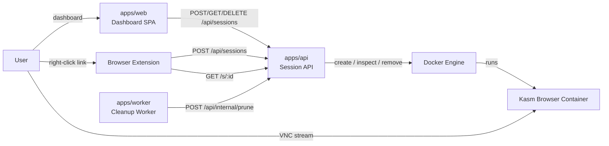
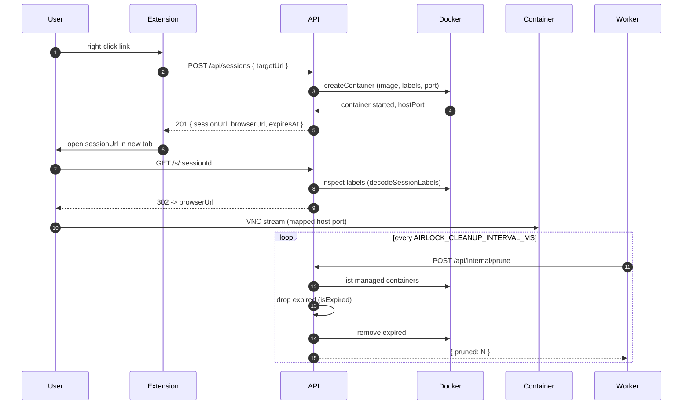
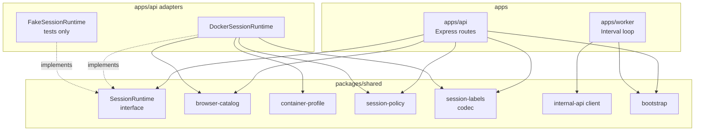

# Architecture

## System Overview



Two clients drive the API: the **dashboard** (`apps/web`, launch + manage +
view) and the **extension** (right-click a link). The API is the only module
that talks to Docker; the worker only knows the public prune endpoint — it
never touches the engine directly. In production the API also serves the built
dashboard, so one origin covers both.

## Session Lifecycle



## Module Map



`SessionRuntime` is the API↔implementation seam. Two real adapters keep it honest: `DockerSessionRuntime` in production, `FakeSessionRuntime` in tests.

## Monorepo Layout

```
├── apps/
│   ├── api/          # Session launcher API (serves the dashboard in prod)
│   ├── web/          # React + Vite dashboard SPA
│   └── worker/       # Cleanup worker (prunes expired sessions)
├── packages/
│   └── shared/       # Shared contracts and types
├── extensions/
│   └── airlock-link-launcher/
│       ├── chrome/   # Chrome/Brave/Edge extension
│       ├── firefox/  # Firefox extension
│       └── src/      # Shared JS/HTML (symlinked)
├── deploy/           # Provider adapters (compose, k8s, vm, fly, render, railway)
├── Dockerfile        # Shared image every deploy adapter builds
└── docker-compose.yml
```

## Auth

The management API (`/api/meta`, `/api/sessions*`) is gated by a bearer token
(`AIRLOCK_API_TOKEN`) via the `createBearerAuth` middleware in `apps/api`. The
token is compared in constant time. Three paths are auth-exempt by design:

- `/healthz` / `/health` — liveness probes must work without a token.
- `/readyz` — readiness probe (pings the Docker engine) is likewise
  auth-exempt; `/metrics` is **not** — it requires the bearer token.
- `/s/:sessionId` — the session id is an unguessable capability, and the link
  is followed by plain navigation that cannot carry an `Authorization` header.

When `AIRLOCK_API_TOKEN` is unset the guard is a no-op (frictionless local
dev). `POST /api/internal/prune` keeps its own shared secret
(`AIRLOCK_INTERNAL_TOKEN`), independent of the bearer token. See
[api.md](api.md#authentication).

## Security Notes

- Sessions are disposable and use Docker `AutoRemove`.
- Session TTL is enforced via container labels + the cleanup worker.
- Browser containers run with isolated filesystem lifecycle (no persistence volumes).
- The management API is unauthenticated until `AIRLOCK_API_TOKEN` is set — **set it before exposing Airlock beyond localhost.**
- A mounted Docker socket is root-equivalent on the host; keep the API behind the token and a TLS-terminating proxy.

## Current Limitations

- Redirect target is `https://<AIRLOCK_SESSION_HOST>:<host-port>` (defaults to `localhost`).
- Kasm stream endpoint uses TLS inside the container; first load may show a certificate warning.
- Session metadata is container-label based and not persisted to a database.
- The bearer token is a single shared secret — there are no per-user accounts or scopes yet.

## Next Steps

- Add multi-user auth (OIDC/JWT) on top of the bearer seam, with per-user scopes.
- Add owner-based authorization checks (session creator can only stop/read own sessions).
- Add rate limits and per-user session quotas.
- Add audit logs and a persistent metadata store.
- Add proxy/VPN egress options for stronger attribution isolation.
