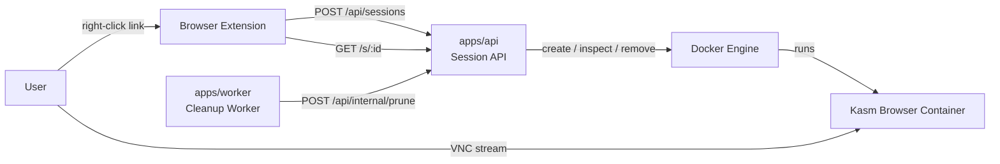
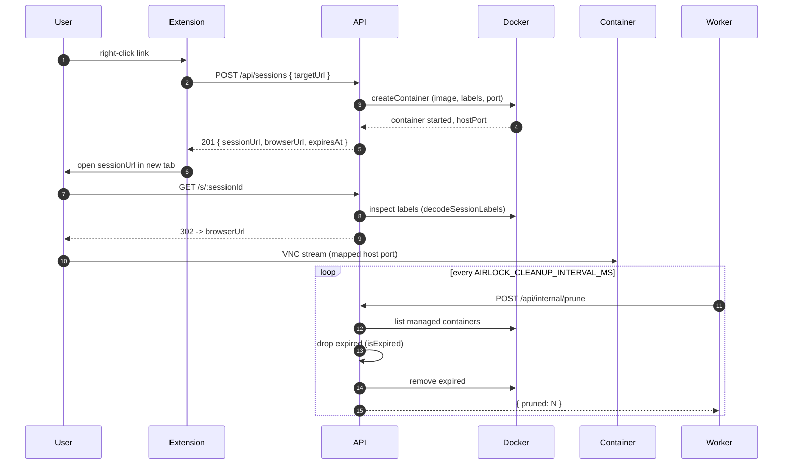
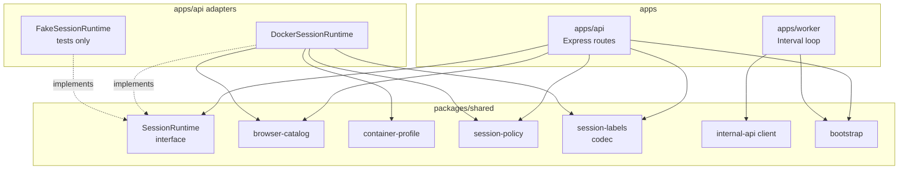

# Architecture

## System Overview



The API is the only module that talks to Docker. The worker only knows the public prune endpoint — it never touches the engine directly.

## Session Lifecycle



## Module Map



`SessionRuntime` is the API↔implementation seam. Two real adapters keep it honest: `DockerSessionRuntime` in production, `FakeSessionRuntime` in tests.

## Monorepo Layout

```
├── apps/
│   ├── api/          # Session launcher API
│   └── worker/       # Cleanup worker (prunes expired sessions)
├── packages/
│   └── shared/       # Shared contracts and types
├── extensions/
│   └── airlock-link-launcher/
│       ├── chrome/   # Chrome/Brave/Edge extension
│       ├── firefox/  # Firefox extension
│       └── src/      # Shared JS/HTML (symlinked)
└── docker-compose.yml
```

## Auth

Auth is intentionally omitted for the MVP. Add it before exposing Airlock beyond local/dev environments. When a real auth provider is wired in, prefer landing it alongside at least one consumer (e.g. a scope check on `/api/sessions`) and a swap-test, so the seam is exercised rather than shape-only.

## Security Notes

- Sessions are disposable and use Docker `AutoRemove`.
- Session TTL is enforced via container labels + the cleanup worker.
- Browser containers run with isolated filesystem lifecycle (no persistence volumes).
- **Add auth before exposing Airlock beyond local/dev environments.**

## Current Limitations

- Redirect target is `https://<AIRLOCK_SESSION_HOST>:<host-port>` (defaults to `localhost`).
- Kasm stream endpoint uses TLS inside the container; first load may show a certificate warning.
- Session metadata is container-label based and not persisted to a database.

## Next Steps

- Add real auth (OIDC/JWT/session) plus at least one scope-checking consumer.
- Add owner-based authorization checks (session creator can only stop/read own sessions).
- Add rate limits and per-user session quotas.
- Add audit logs and a persistent metadata store.
- Add proxy/VPN egress options for stronger attribution isolation.
