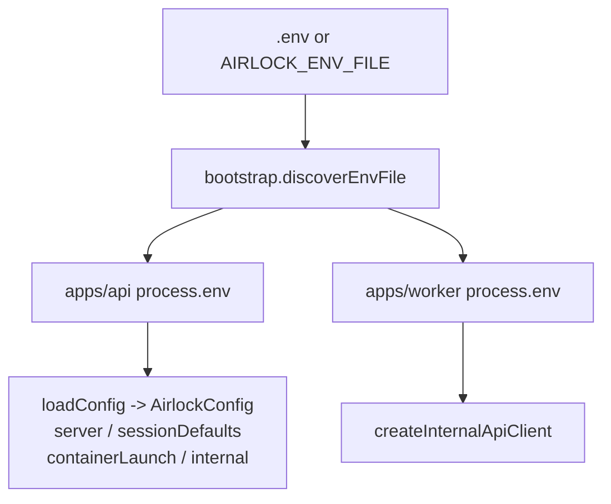

# Configuration

## Prerequisites

- Docker Desktop running locally
- [Bun](https://bun.sh) 1.1+

## Environment Variables

Both apps load env via the shared `discoverEnvFile` helper: it walks up from the app directory looking for a `.env` file, or honors `AIRLOCK_ENV_FILE` if set.



`AIRLOCK_INTERNAL_TOKEN` is the only variable that must agree across both apps — the API uses it to gate `/api/internal/prune`, the worker sends it as the `x-airlock-internal-token` header.

### API (`apps/api`)

| Variable                      | Default                      | Description                                                                                           |
| ----------------------------- | ---------------------------- | ----------------------------------------------------------------------------------------------------- |
| `AIRLOCK_PORT`                | `8787`                       | API server port                                                                                       |
| `AIRLOCK_PUBLIC_BASE_URL`     | `http://localhost:8787`      | Public base URL for session links                                                                     |
| `AIRLOCK_SESSION_HOST`        | `localhost`                  | Host used in redirect URLs to browser containers                                                      |
| `AIRLOCK_DOCKER_SOCKET_PATH`  | `/var/run/docker.sock`       | Path to the Docker socket                                                                             |
| `AIRLOCK_DEFAULT_TTL_SECONDS` | `1800`                       | Default session lifetime when the request omits `ttlSeconds` (clamped 60–86400)                       |
| `AIRLOCK_DEFAULT_BROWSER`     | `chromium`                   | Default browser kind (`chromium`, `chrome`, `firefox`, `edge`, `brave`, `vivaldi`, `tor`)             |
| `AIRLOCK_VNC_PASSWORD`        | `change-me`                  | VNC password for browser containers                                                                   |
| `AIRLOCK_SHM_SIZE_BYTES`      | `1073741824`                 | Shared memory size for containers (clamped 256MB–4GB)                                                 |
| `AIRLOCK_INTERNAL_TOKEN`      | _(none)_                     | Token to protect the prune endpoint. When set, requests must send `x-airlock-internal-token: <token>` |
| `AIRLOCK_IMAGE_CHROMIUM`      | `kasmweb/chromium:1.18.0`    | Docker image for Chromium                                                                             |
| `AIRLOCK_IMAGE_CHROME`        | `kasmweb/chrome:1.18.0`      | Docker image for Chrome                                                                               |
| `AIRLOCK_IMAGE_FIREFOX`       | `kasmweb/firefox:1.18.0`     | Docker image for Firefox                                                                              |
| `AIRLOCK_IMAGE_EDGE`          | `kasmweb/edge:1.18.0`        | Docker image for Edge                                                                                 |
| `AIRLOCK_IMAGE_BRAVE`         | `kasmweb/brave:1.18.0`       | Docker image for Brave                                                                                |
| `AIRLOCK_IMAGE_VIVALDI`       | `kasmweb/vivaldi:1.18.0`     | Docker image for Vivaldi                                                                              |
| `AIRLOCK_IMAGE_TOR`           | `kasmweb/tor-browser:1.18.0` | Docker image for Tor Browser                                                                          |

### Worker (`apps/worker`)

| Variable                      | Default                 | Description                                                            |
| ----------------------------- | ----------------------- | ---------------------------------------------------------------------- |
| `AIRLOCK_API_BASE_URL`        | `http://localhost:8787` | Base URL of the API to call for prune                                  |
| `AIRLOCK_CLEANUP_INTERVAL_MS` | `30000`                 | Interval between prune calls (minimum `5000`)                          |
| `AIRLOCK_INTERNAL_TOKEN`      | _(none)_                | Must match the API's token if the API is protecting the prune endpoint |

### Shared

| Variable           | Default  | Description                                                                                             |
| ------------------ | -------- | ------------------------------------------------------------------------------------------------------- |
| `AIRLOCK_ENV_FILE` | _(auto)_ | Explicit path to a `.env` file. If unset, both apps walk up from their app directory looking for `.env` |

## Quick Start

### Local Process Mode

```bash
bun install
cp .env.example .env
bun run dev:api    # in one terminal
bun run dev:worker # in another terminal
```

### Docker Compose Mode

```bash
docker compose up
```

This runs the API and worker from source in containers (`oven/bun:1`). The API controls local Docker through `/var/run/docker.sock`.

## Checks

```bash
bun run typecheck   # tsc --noEmit across all workspaces
bun run lint        # oxlint (correctness category)
bun run test        # vitest in apps/api
bun run format:check # prettier
```
