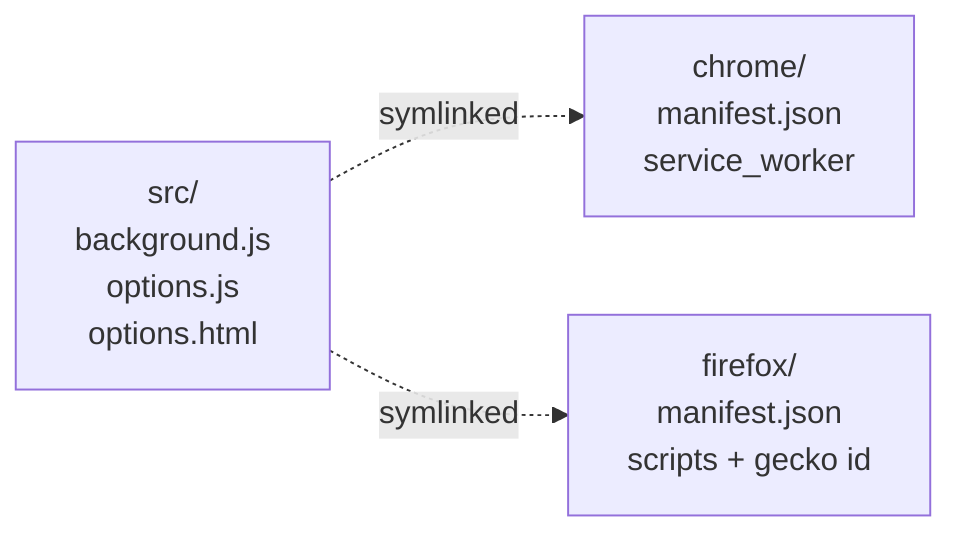

# Browser Extensions

Airlock provides browser extensions that add an **Open in Airlock** context menu item to right-click on any link.

Both extensions share the same source code (`extensions/airlock-link-launcher/src/`) and differ only in their `manifest.json`.

## Chrome / Brave / Edge

1. Open your browser and go to `chrome://extensions`.
2. Enable **Developer mode**.
3. Click **Load unpacked**.
4. Select `extensions/airlock-link-launcher/chrome`.
5. (Optional) Right-click the extension icon → **Options** to set a custom API base URL.

## Firefox

1. Open Firefox and go to `about:debugging#/runtime/this-firefox`.
2. Click **Load Temporary Add-on…**.
3. Select any file inside `extensions/airlock-link-launcher/firefox/` (e.g. `manifest.json`).
4. (Optional) Go to `about:addons` → Airlock → **Preferences** to set a custom API base URL.

> **Note:** The Firefox extension loads as a temporary add-on and will be removed when Firefox closes. For persistent installation, package it with `web-ext build` or submit to AMO.

## Extension Structure



```
extensions/airlock-link-launcher/
├── src/                    # Shared source
│   ├── background.js       # Context menu + session creation logic
│   ├── options.js          # Settings page logic
│   └── options.html        # Settings page template
├── chrome/
│   ├── manifest.json       # Chrome manifest (service_worker)
│   ├── background.js → ../../src/background.js
│   ├── options.js    → ../../src/options.js
│   └── options.html  → ../../src/options.html
└── firefox/
    ├── manifest.json       # Firefox manifest (scripts, gecko id)
    ├── background.js → ../../src/background.js
    ├── options.js    → ../../src/options.js
    └── options.html  → ../../src/options.html
```

The shared JavaScript uses `typeof browser !== "undefined" ? browser : chrome` to work across both browsers.
