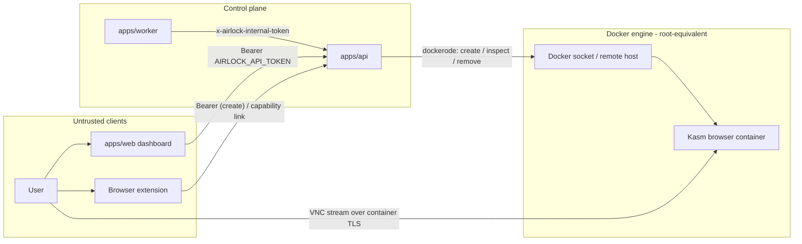

# Security

Airlock launches disposable browser containers and serves an HTTP API plus a
live VNC stream of each session. This page covers the trust boundaries and the
operator controls that protect them.

## Trust model

The control plane is a single Express process (`apps/api`) that is the **only**
component allowed to talk to the Docker engine. Everything else — the dashboard
(`apps/web`), the browser extension, and the cleanup worker (`apps/worker`) —
reaches Docker indirectly through the API's HTTP surface.



The two strongest boundaries are the **bearer token** in front of the
management API and the **Docker engine access** behind it. The worker never
touches the engine — it only calls the public prune endpoint.

## Bearer authentication

`/api/meta` and every `/api/sessions*` route require
`Authorization: Bearer <AIRLOCK_API_TOKEN>`. The token is compared in constant
time (`timingSafeEqual` in `apps/api/src/auth.ts`); a mismatch returns `401`
with `{"error":"Unauthorized."}`. Set a strong token before exposing the API:

```bash
export AIRLOCK_API_TOKEN=$(openssl rand -hex 16)
```

When `AIRLOCK_API_TOKEN` is **unset** the guard is a no-op — local and
single-developer runs stay frictionless. This is a development convenience, not
a production posture: never expose Airlock beyond loopback without a token.

### Secure-by-default warning

When `AIRLOCK_API_TOKEN` is unset **and** the API is bound beyond loopback
(`AIRLOCK_BIND_HOST` is not `127.0.0.1`), the API logs a loud startup warning.
The combination is unauthenticated and reachable from the network — set a token
or bind to loopback. Use `AIRLOCK_BIND_HOST=127.0.0.1` to restrict the listener
to the local host.

### Auth-exempt paths

These paths bypass the bearer guard by design:

- **`GET /healthz` and `GET /health`** — liveness probes must answer without a
  token so orchestrators and the image `HEALTHCHECK` can poll them. They return
  only `{"ok":true}` and leak no session data.
- **`GET /readyz`** — the readiness probe reports only whether the Docker engine
  is reachable (`{"ok":…,"engine":…}`); like the liveness probes it must answer
  without a token and leaks no session data.
- **`GET /s/:sessionId`** — the session id is an unguessable UUID capability.
  The short link is followed by plain browser navigation (a `302` redirect to
  the container stream) that cannot attach an `Authorization` header, so gating
  it with a bearer token would break the core flow. Knowledge of the id _is_
  the authorization; it is never listed by an unauthenticated caller.

## Internal prune token

`POST /api/internal/prune` is the API↔worker channel and uses a **separate**
shared secret, `AIRLOCK_INTERNAL_TOKEN`, sent as the `x-airlock-internal-token`
header — not the bearer token. When the secret is set the API rejects a
missing or mismatched header with `401`; when it is unset the endpoint is open
(acceptable only when the API is not reachable from outside the deployment).
Keep this secret distinct from `AIRLOCK_API_TOKEN` and equal across the API and
worker.

## Docker engine access

A mounted `/var/run/docker.sock` is **root-equivalent on the host**: the API
can create, inspect, and remove containers, which is enough to take over the
machine. The remote-engine path (`AIRLOCK_DOCKER_HOST`) is equally privileged —
an unprotected `tcp://` Docker endpoint is a full host compromise. Mitigations:

- Keep the API behind the bearer token **and** a TLS-terminating reverse proxy
  whenever it is reachable beyond localhost.
- Prefer a TLS-protected remote engine (`https://`, with
  `AIRLOCK_DOCKER_CERT_PATH` providing `ca.pem`/`cert.pem`/`key.pem`) over a
  plaintext socket exposed on the network.
- Run the control-plane container unprivileged (the image already runs as UID
  `10001`); the privilege lives in the socket it is given, so scope that
  carefully.

See [deployment.md](deployment.md) for the host-socket vs. remote-engine split.

## Container isolation posture

Each session is a single Kasm browser container with a disposable lifecycle:

- **`AutoRemove`** — containers are created with `HostConfig.AutoRemove`, so
  they self-delete when stopped; `DELETE /api/sessions/:id` and the prune loop
  force-remove them.
- **No persistence volumes** — browser containers mount no host paths and keep
  no state across sessions; the filesystem dies with the container.
- **Per-session VNC password** — each session gets a **distinct** random VNC
  secret returned as `vncPassword`. Knowing one stream's credentials never
  grants access to another, which replaces the previously shared password.
  `AIRLOCK_VNC_PASSWORD` remains as the fallback default.
- **Resource caps** — each container is launched with a memory cap
  (`AIRLOCK_SESSION_MEMORY_BYTES`, default 2 GiB), a CPU cap
  (`AIRLOCK_SESSION_CPUS`, default 2, converted to Docker NanoCpus), and a PID
  cap (`AIRLOCK_SESSION_PIDS_LIMIT`, default 512). Each is uncapped when set to
  `0`. These bound a single runaway session's blast radius on the host.
- **`no-new-privileges`** — containers run with the `no-new-privileges`
  security option so a process inside cannot gain privileges via setuid
  binaries.
- **Self-signed TLS** — the stream URL is
  `https://<AIRLOCK_SESSION_HOST>:<mapped-port>` served by the container's own
  certificate. The first load may show a browser certificate warning; this is
  expected, not a man-in-the-middle.
- **Bounded shared memory** — `ShmSize` is clamped to 256 MB–4 GB (default
  1 GB) so a session cannot exhaust host memory through `/dev/shm`.

## Network isolation

By default (`AIRLOCK_NETWORK_ISOLATION=true`) sessions attach to a dedicated
bridge network (`AIRLOCK_NETWORK_NAME`, default `airlock`) created on demand
with inter-container communication (ICC) disabled. ICC-off means sessions
cannot reach each other or unrelated containers on the same host. When set to
`false`, containers join the default bridge instead.

Set `AIRLOCK_EGRESS_PROXY` to route all session egress through an HTTP(S)
proxy: the value is injected into browser containers as `HTTP_PROXY` /
`HTTPS_PROXY`.

**Residual gap — be explicit:** the ICC-disabled bridge does **not** block a
session from reaching the host, the LAN / other RFC1918 addresses, or cloud
metadata endpoints (`169.254.169.254`). Blocking those still requires host
firewall rules or routing egress through `AIRLOCK_EGRESS_PROXY`; the bridge
alone is not sufficient.

## DoS protection

Two operator controls bound resource exhaustion on `POST /api/sessions`:

- **Concurrent-session cap** — `AIRLOCK_MAX_SESSIONS` (default 25, `0` =
  unlimited). Creation past the cap returns `429`.
- **Per-IP rate limit** — a fixed window of `AIRLOCK_RATE_LIMIT_WINDOW_MS`
  (default 60000) allows `AIRLOCK_RATE_LIMIT_MAX` requests per IP (default 30,
  `0` = disabled). Over-limit requests return `429` with a `Retry-After`
  header.

## Stateless metadata

Airlock holds **no database**. Session metadata lives entirely in Docker
container labels (`airlock.managed`, `airlock.session_id`, `airlock.browser`,
`airlock.target_url`, `airlock.created_at`, `airlock.expires_at`). There is no
state file or credential store to leak; the engine is the source of truth and a
restart reconstructs the session list by inspecting it.

## What is not yet covered

Airlock uses a **single shared bearer token** — there are no per-user accounts
or scopes. The following are explicitly out of scope today:

- Multi-user authentication (OIDC/JWT) and owner-based authorization (any token
  holder can read or stop any session).

**Now partially addressed:**

- Rate limiting and quotas — a per-IP rate limit and a concurrent-session cap
  now exist (see [DoS protection](#dos-protection)). Per-**user** quotas remain
  future work.
- Audit / metadata — structured JSON logs now emit per-event records (see
  [operations.md](operations.md)). A full audit log and a persistent metadata
  store are still future work.
- Egress isolation — an optional egress proxy (`AIRLOCK_EGRESS_PROXY`) now
  exists; a VPN-grade egress path is still future work.

These are tracked as future work in
[architecture.md](architecture.md#next-steps).

## Reporting a vulnerability

Do not open a public issue for security problems. Follow the disclosure process
in [reference/SECURITY.md](reference/SECURITY.md).
