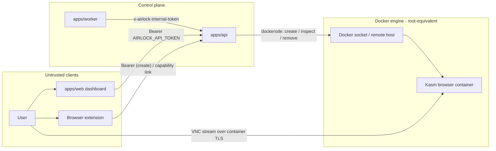

# Security

Airlock launches disposable browser containers and serves an HTTP API plus a
live VNC stream of each session. This page covers the trust boundaries and the
operator controls that protect them.

## Trust model

The control plane is a single Express process (`apps/api`) that is the **only**
component allowed to talk to the Docker engine. Everything else — the dashboard
(`apps/web`), the browser extension, and the cleanup worker (`apps/worker`) —
reaches Docker indirectly through the API's HTTP surface.



The two strongest boundaries are the **bearer token** in front of the
management API and the **Docker engine access** behind it. The worker never
touches the engine — it only calls the public prune endpoint.

## Bearer authentication

`/api/meta` and every `/api/sessions*` route require
`Authorization: Bearer <AIRLOCK_API_TOKEN>`. The token is compared in constant
time (`timingSafeEqual` in `apps/api/src/auth.ts`); a mismatch returns `401`
with `{"error":"Unauthorized."}`. Set a strong token before exposing the API:

```bash
export AIRLOCK_API_TOKEN=$(openssl rand -hex 16)
```

When `AIRLOCK_API_TOKEN` is **unset** the guard is a no-op — local and
single-developer runs stay frictionless. This is a development convenience, not
a production posture: never expose Airlock beyond loopback without a token.

### Auth-exempt paths

Three paths bypass the bearer guard by design:

- **`GET /healthz` and `GET /health`** — liveness probes must answer without a
  token so orchestrators and the image `HEALTHCHECK` can poll them. They return
  only `{"ok":true}` and leak no session data.
- **`GET /s/:sessionId`** — the session id is an unguessable UUID capability.
  The short link is followed by plain browser navigation (a `302` redirect to
  the container stream) that cannot attach an `Authorization` header, so gating
  it with a bearer token would break the core flow. Knowledge of the id _is_
  the authorization; it is never listed by an unauthenticated caller.

## Internal prune token

`POST /api/internal/prune` is the API↔worker channel and uses a **separate**
shared secret, `AIRLOCK_INTERNAL_TOKEN`, sent as the `x-airlock-internal-token`
header — not the bearer token. When the secret is set the API rejects a
missing or mismatched header with `401`; when it is unset the endpoint is open
(acceptable only when the API is not reachable from outside the deployment).
Keep this secret distinct from `AIRLOCK_API_TOKEN` and equal across the API and
worker.

## Docker engine access

A mounted `/var/run/docker.sock` is **root-equivalent on the host**: the API
can create, inspect, and remove containers, which is enough to take over the
machine. The remote-engine path (`AIRLOCK_DOCKER_HOST`) is equally privileged —
an unprotected `tcp://` Docker endpoint is a full host compromise. Mitigations:

- Keep the API behind the bearer token **and** a TLS-terminating reverse proxy
  whenever it is reachable beyond localhost.
- Prefer a TLS-protected remote engine (`https://`, with
  `AIRLOCK_DOCKER_CERT_PATH` providing `ca.pem`/`cert.pem`/`key.pem`) over a
  plaintext socket exposed on the network.
- Run the control-plane container unprivileged (the image already runs as UID
  `10001`); the privilege lives in the socket it is given, so scope that
  carefully.

See [deployment.md](deployment.md) for the host-socket vs. remote-engine split.

## Container isolation posture

Each session is a single Kasm browser container with a disposable lifecycle:

- **`AutoRemove`** — containers are created with `HostConfig.AutoRemove`, so
  they self-delete when stopped; `DELETE /api/sessions/:id` and the prune loop
  force-remove them.
- **No persistence volumes** — browser containers mount no host paths and keep
  no state across sessions; the filesystem dies with the container.
- **VNC password** — the stream is protected by `AIRLOCK_VNC_PASSWORD`. Its
  default is `change-me`; change it before any non-local use.
- **Self-signed TLS** — the stream URL is
  `https://<AIRLOCK_SESSION_HOST>:<mapped-port>` served by the container's own
  certificate. The first load may show a browser certificate warning; this is
  expected, not a man-in-the-middle.
- **Bounded shared memory** — `ShmSize` is clamped to 256 MB–4 GB (default
  1 GB) so a session cannot exhaust host memory through `/dev/shm`.

## Stateless metadata

Airlock holds **no database**. Session metadata lives entirely in Docker
container labels (`airlock.managed`, `airlock.session_id`, `airlock.browser`,
`airlock.target_url`, `airlock.created_at`, `airlock.expires_at`). There is no
state file or credential store to leak; the engine is the source of truth and a
restart reconstructs the session list by inspecting it.

## What is not yet covered

Airlock uses a **single shared bearer token** — there are no per-user accounts
or scopes. The following are explicitly out of scope today:

- Multi-user authentication (OIDC/JWT) and owner-based authorization (any token
  holder can read or stop any session).
- Per-user session quotas and rate limiting.
- An audit log or persistent metadata store.
- An egress proxy/VPN for stronger attribution isolation.

These are tracked as future work in
[architecture.md](architecture.md#next-steps).

## Reporting a vulnerability

Do not open a public issue for security problems. Follow the disclosure process
in [reference/SECURITY.md](reference/SECURITY.md).
