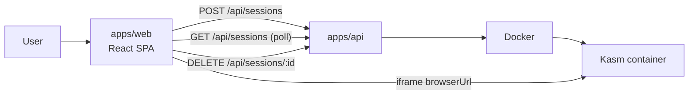

# Web Dashboard

`apps/web` is a React + Vite single-page app for launching and managing
disposable browser sessions — the browser-based equivalent of the right-click
extension, and the closest analogue to a hosted cloud-browser product, but
pointed at your own local Airlock.



## What it does

- **Token login.** If the API has `AIRLOCK_API_TOKEN` set, the dashboard prompts
  for it and stores it in `localStorage`. With no token configured, it connects
  straight through.
- **Launch.** Enter a URL, pick a browser (from `GET /api/meta`), set a
  lifetime, and launch. The browser catalog and TTL bounds come from the API,
  so the form always matches the server's configuration.
- **Manage.** Active sessions are polled from `GET /api/sessions` every few
  seconds with a live countdown to expiry. Each can be opened or terminated.
- **View.** Opening a session embeds the container's stream in an iframe, with
  an "open in new tab" fallback for the container's self-signed certificate.

## Running it

**Development** — Vite dev server with API proxy:

```bash
bun run dev:api   # API on :8787
bun run dev:web   # dashboard on :5173, proxies /api and /s → :8787
```

Override the proxy target with `AIRLOCK_API_BASE_URL` if the API is elsewhere.

**Production** — the dashboard is built and served by the API from one origin:

```bash
bun run --filter @airlock/web build   # emits apps/web/dist
# the Docker image copies this to apps/api/dist/public and the API serves it
```

The API serves the SPA whenever `AIRLOCK_WEB_DIR` points at a build (the image
sets this to the bundled `dist/public` automatically). SPA routes fall back to
`index.html`; `/api/*`, `/s/*`, and the health probes are never shadowed.

## Layout

| Path                       | Responsibility                                                         |
| -------------------------- | ---------------------------------------------------------------------- |
| `src/lib/api.ts`           | Framework-free API client (bearer auth, typed responses). Unit-tested. |
| `src/lib/time.ts`          | `formatTimeRemaining` countdown helper. Unit-tested.                   |
| `src/lib/token-storage.ts` | `localStorage`-backed token persistence.                               |
| `src/App.tsx`              | Auth gate, polling, and the launch/list/view state machine.            |
| `src/components/`          | `LoginScreen`, `LaunchForm`, `SessionList`, `SessionViewer`.           |

The client lib is deliberately separate from React so the request/response
contract is tested without a DOM.
